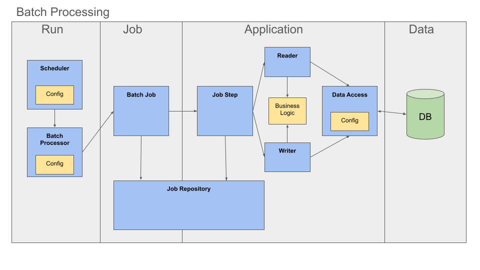
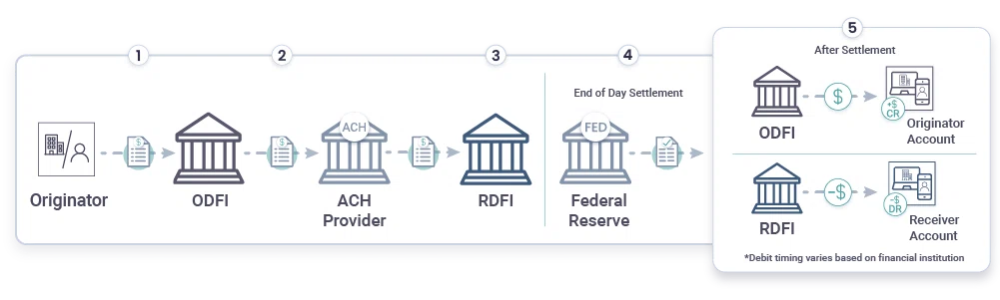
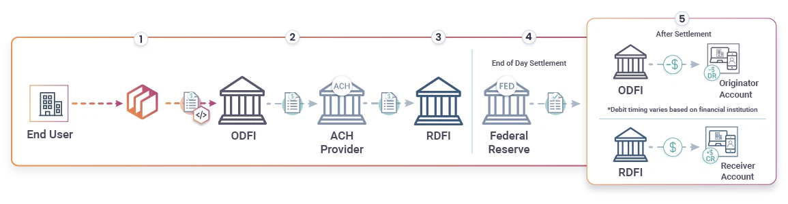

# Problem
Build a credit card payment system to integrate with an existing expense reporting application and/or its data. The system shall aggregate charges from a given time period for each employee or contractor, and then initiate a bank transfer to pay the credit card bill on their behalf. The system shall be an automated, end-of-cycle process that runs at a specified time interval. Note that logic shall be applied in order to validate or invalidate specific charges based on an existing expert system.

# Prerequisites
* Enroll in ACH services with bank(s). Securely store account and API credentials.
* Add payees (credit card companies) to bank ACH service.
* Review bank(s) ACH API documentation to determine minimum required data for ACH payment initiation API calls and ensure that API suits the needs of the system (idempotency via globally unique identifiers per transaction).

# Assumptions
* A corporate credit card is associated with an employee or contractor within the system.
* A monthly credit card statement can be generated for each employee or contractor.
* A payment date can be determined for any given corporate credit card, and credit card bills are paid in full monthly. While the credit card bill is paid in full, the employee or contractor may still owe the company money for non-compliant charges (system must report this).
* Credit card disputed charges are handled outside of the system.
* Logic shall be developed to reconcile expense-reporting system data with credit card charges. Any discrepancies will be reported to the employee or contractor.
* All monetary values are in USD. If this is insufficient, a currency converter will be required.

If any of the above assumptions are not true, then the system will need to be modified accordingly.

# Must-haves
* ACH debit/pull bank transfer: generate an ACH file and initiate a bank transfer via an API call. Requires bank account information (account number, routing number, etc.), as well as debit authorization.
* Exactly once processing (idempotency): processing the same data twice will not result in double-payment.
* Start/stop/retry (checkpoint/restart): record information in each step so that it can be restarted in case of an abnormal termination.
* Security: sensitive data (credit card info, bank account info) is encrypted in transit and at rest. Authentication for API calls. Protect account information and API credentials.
* Asynchronous: the batch job should not block the caller, meaning that a system must be in place to receive the transaction status result.
* Accurate: the batch job should process all of the data, even in case of an aborted transaction.
* Reliable: failures are handled gracefully (error handling, retry).
* Apply business rules to the data for compliance and validation.
* Reporting, logging, and audit trails to analyze batch jobs for success/failure/retry, etc.

# Nice-to-haves
* High performance
* Fully automated (no manual processes)

# Architectural Characteristics (Key Constraints)
Sometimes known as non-functional requirements, these are the characteristics that define the architecture of the system outside of the problem domain. Desired characteristics include:  
* Security (a tradeoff with performance)
* Reliability (another tradeoff with performance)
* Testability (demonstrate that the system works as expected in a sandbox environment)

While performance is not a key architectural characteristic, I do not anticipate performance being an issue. Batch implementations are typically I/O bound, and not CPU bound. The batch job will be run once a month, and the data volume is not expected to be large.

Scalability is not anticipated to be an issue due to relatively the low volume of data, and the fact that batch jobs are scheduled instead of run in real time.

The batch system should have its own database, separated from the current expense-reporting database. This will require a preprocessor to extract the data from the expense-reporting database and load it into the batch database. Keeping the databases separate will allow the batch system to be developed and tested independently of the expense-reporting system.

# Logical and Domain-specific Components
* Data ingestor: read pertient data over the specified time period from the database.
* Charge aggregator: aggregates charges for a given time period for a given employee or contractor, and stores data in the batch job repository.
* Reconciliator: reconciles expense-reporting system data with credit card charges.
* Compliance checker: checks for charge compliance by applying business rules, and whether given employee or contractor is authorized to make the charge.
* Compliance notifier: notifies the employee or contractor of any compliance issues.
* Accounts configuration: bank account numbers, destination credit card account info, payment reference numbers, transaction codes, etc.
* Rules configuration: business rules for compliance checking.
* Scheduler (+configuration): schedules the job to run at a specific time.
* Batch Job (+configuration): a named job that defines the steps to be executed.
* Batch Job Repository: stores job metadata.
* Batch Job Step: defines the smallest unit of work to be done.
* Data Access: query internal database as necessary.
* Bank transactor: initiate ACH bank transfer (ACH file generation and ACH API call to initiate payment)
* Status tracker: observes jobs for their status

A batch job cannot be started unless predefined criteria are met. Criteria could include an employee or contractor's charges are non-compliant, and need manager's approval, etc. In this case, the batch job should initiate the appropriate notifications, record the data, set a failure status, and exit.

# Future-proofing
The system should be designed to run in a containerized environment, such as Docker or Kubernetes, deployed in a cloud or virtual private cloud. The database can be hosted and fully managed in the cloud. Deployments should be simplified by integrating with CI/CD early on. With a modern spring boot application, utilizing the latest versions of Java, Spring, and Spring Batch, the system should be able to run for many years without requiring a major upgrade.

# Backend
Table model for the backend database. The backend database will be a relational database, and store the following data. Note that any sensitive data will be encrypted using Transparent Data Encryption (TDE). In Spring, we can use 128-bit AES encryption from the Java Cryptography Extension (JCE) framework. The encryption key(s) will be stored in a secure location, such as a key vault.

User Table  
| Column Name | Data Type | Description |
| ----------- | --------- | ----------- |
| employee_id | UUID      | Unique id for the user |
| name        | VARCHAR   | User name |
| email       | VARCHAR   | User email address |
| ...         | ...       | ... |

Transaction Table  
| Column Name | Data Type | Description |
| ----------- | --------- | ----------- |
| transaction_id | UUID   | Unique id for the transaction |
| employee_id    | UUID   | (FK) Unique id for the user |
| vendor         | VARCHAR| Vendor name |
| amount         | VARCHAR| Transaction amount in USD |
| timestamp      | DATE   | Transaction timestamp |
| ...            | ...    | ... |

Credit Card Table  
| Column Name | Data Type | Description |
| ----------- | --------- | ----------- |
| employee_id | UUID      | Unique id for the user |
| credit_card_number | VARCHAR | Credit card number |
| credit_card_expiration | DATE | Credit card expiration date |
| ...         | ...       | ... |

Bank Table  
| Column Name | Data Type | Description |
| ----------- | --------- | ----------- |
| bank_id     | UUID      | Unique id for the bank |
| bank_name   | VARCHAR   | Bank name |
| bank_account_number | VARCHAR | Bank account number |
| bank_routing_number | VARCHAR | Bank routing number |
| ...         | ...       | ... |

Batch Job Configuration Table  
| Column Name | Data Type | Description |
| ----------- | --------- | ----------- |
| job_id      | UUID      | Unique id for the job |
| job_name    | VARCHAR   | Job name |
| ...         | ...       | ... |

Batch Job Execution Table  
| Column Name | Data Type | Description |
| ----------- | --------- | ----------- |
| bank_transaction_id | UUID | Unique id for the bank transaction |
| job_id      | UUID      | Unique id for the job |
| job_execution_id | UUID  | Unique id for the job execution |
| status | VARCHAR | Job execution status |
| start_time | DATE | Job execution start time |
| end_time | DATE | Job execution end time |
| exit_status | VARCHAR | Job execution exit status |
| ...         | ...       | ... |

Batch Job Instance Table
| Column Name | Data Type | Description |
| ----------- | --------- | ----------- |
| job_instance_id | UUID  | Unique id for the job instance |
| job_name    | VARCHAR   | Job name |
| ...         | ...       | ... |

Batch Job Parameters Table
| Column Name | Data Type | Description |
| ----------- | --------- | ----------- |
| job_instance_id | UUID  | Unique id for the job instance |
| type        | VARCHAR   | Parameter type |
| key         | VARCHAR   | Parameter key |
| value       | VARCHAR   | Parameter value |
| ...         | ...       | ... |

Batch Step Execution Table
| Column Name | Data Type | Description |
| ----------- | --------- | ----------- |
| step_execution_id | UUID  | Unique id for the step execution |
| step_name   | VARCHAR   | Step name |
| status | VARCHAR | Step execution status |
| start_time | DATE | Step start time |
| end_time | DATE | Step end time |
| exit_status | VARCHAR | Step execution exit status |
| execution_context | VARCHAR | Set of execution properties |
| commit_count | INT | Number of transactions committed for this execution |
| item_count | INT | Number of items processed for this execution |
| ...         | ...       | ... |

# Middle-tier
The middle-tier will implement all [logical and domain-specific components](#logical-and-domain-specific-components) as well as the [low-level design patterns](#low-level-design-patterns). The middle-tier will be implemented as a spring boot application, and will expose an API to initiate batch jobs. The API will accept a request to initiate a batch job, and return a job id. The API will also accept a job id and return the status of the job. The API will be secured using OAuth2.0, and will require a bearer token to access. The API will be implemented using the [OpenAPI Specification](https://swagger.io/specification/).

* An API to initiate batch jobs: the API will accept a request to initiate a batch job, and return a job id.
* Business logic to execute batch payment jobs
* Rulesets for compliance checking, etc.
* Error handling, monitoring, and reporting
* Security: data is encrypted in transit and at rest. Authentication for API calls. Protect account information and API credentials.

# Low-Level Design Patterns
* Chain of Responsibility: each step in the batch job is sequentially executed, and the current step can initiate the call to the next step.
* Command: each step in the batch job is a command.
* Strategy: business rule algorithms have a common interface.
* Observer: the job launcher is the subject, and the job runner is the observer.

# Batch Processing
Key characteristics of a batch processing system include:
* Not required to run in a real-time (stream processing) environment; can be scheduled to run overnight, for instance
* A volume of data is processed (not a single record)
* Runs at a scheduled time or interval (usually after hours)

## The Batch Job
A named job that defines the steps to be executed. A job can be executed multiple times, where each execution is a job instance. Jobs may be stoppable and restartable. A job instance must be provided a set of parameters which define its contract. The execution of a job should update the status of a job instance, e.g. STARTED, COMPLETED, FAILED, as well as timestamps for start and end times, and an exit status; all of these execution properties should be persisted to a job repository.

## Steps
Steps represent independent, sequential phases of a job (chain of responsibility pattern). Steps allow for data loading, applying business rules, transforming or mapping the data (processing), and writing the data or executing an external API call.

# Implementations
I have evaluated 3 possible Java batch processing implementations: homegrown, easy batch, and spring batch. Each option has a demo application that reads a CSV file and writes the data to the console. The demo applications are implemented as spring boot console applications.

## [Homegrown Implementation](https://github.com/jimnewpower/batch/tree/main/homegrown)
Simplest solution is to write your own batch processing code. This is a good option if you have a small number of batch jobs and you don't need to scale. A LinkedBlockingQueue can be used to queue the work, and a thread pool can be used to process the work. 

[Demo application](https://github.com/jimnewpower/batch/tree/main/homegrown) is a spring boot console application.

Pros:
* No dependencies
* Low overhead, nothing hidden
* Total control of implementation

Cons:
* Must implement and maintain everything yourself (error handling, monitoring, start/stop, etc.)
* Error-prone
* Time-consuming
* Creates technical debt

Note that a homegrown solution may be augmented with a 3rd party library such as [jach](https://github.com/afrunt/jach), which provides a java framework for reading and writing ACH files.

## [Easy Batch Implementation](https://github.com/j-easy/easy-batch)
Easy Batch is a 3rd party framework for batch processing. It provides a simple programming model that includes a JobBuilder, JobExecutor, and JobReport.

[Demo application](https://github.com/jimnewpower/batch/tree/main/easy) is a spring boot console application.

Pros:
* Open source, and available on Maven Central
* Simple implementation
* Multiple contributors
* [Good documentation](https://github.com/j-easy/easy-batch/wiki/getting-started)

Cons:
* Project is in maintenance mode: no new features, only bug fixes
* Limited community thus limited support
* Dependencies
* 3rd Party libraries can be prone to vulnerabilities

## [Spring Batch Implementation](https://spring.io/projects/spring-batch)
Spring Batch is a robust framework for development of batch applications. Optimized for speed and scalability. 

Pros:
* Robust
* Full featured (error handling, monitoring, start/stop, etc.)
* Well documented
* Active community
* Spring Boot integration

Cons:
* More complex
* Steeper learning curve
* Vendor lock-in

# Demo Data
Demo data is a CSV file with 3600 records. Each row contains two UUIDs: the first id represents a user id, while the second id represents a transaction id. The same user id may appear multiple times in the file, while each transaction id is unique. The idea here is that you can use the user id to lookup the user information (name, etc.) in a database, and then use the transaction id to lookup the transaction information (vendor, amount, timestamp, etc.) in a database.

# Diagrams
ACH debit/pull bank transfer  

ACH debit/pull bank transfer via API  

# Glossary
* ACH: Automated Clearing House, a network for financial transactions in the United States
* NACHA: National Automated Clearing House Association, the organization that oversees the ACH network
* ODFI: Originating Depository Financial Institution, the bank that initiates the ACH transaction
* RDFI: Receiving Depository Financial Institution, the bank that receives the ACH transaction

